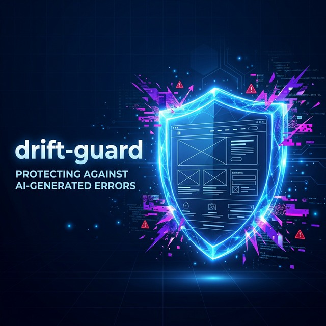
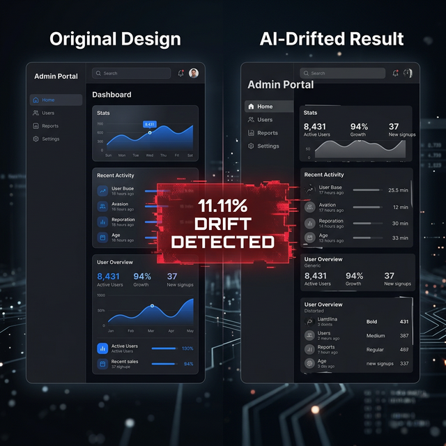
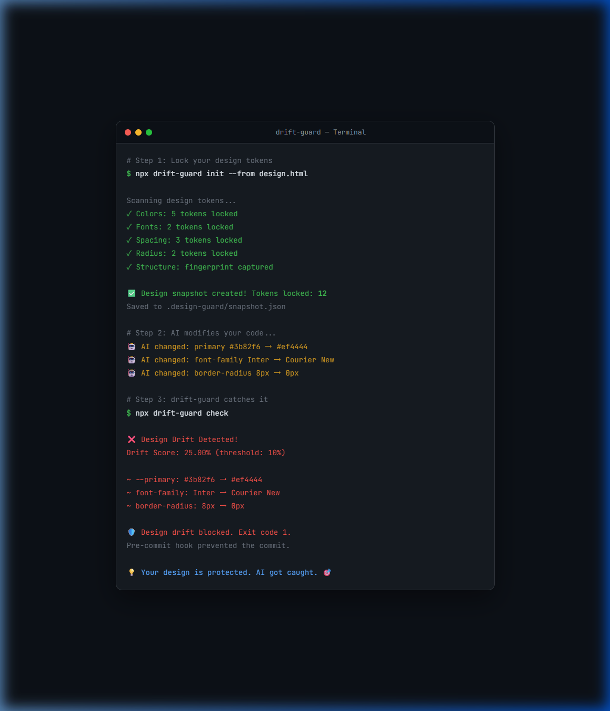
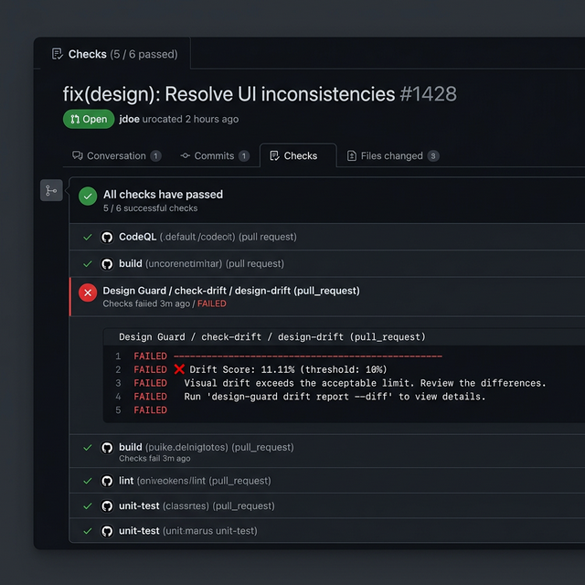

# 🛡️ drift-guard

<p align="center">
  <strong>AI coding agents will break your design.<br>drift-guard won't let them.</strong>
</p>

<p align="center">
  <a href="https://www.npmjs.com/package/@stayicon/drift-guard"></a>
  <a href="https://opensource.org/licenses/MIT"></a>
  <a href="https://github.com/Hwani-Net/drift-guard"></a>
  <a href="https://www.npmjs.com/package/@stayicon/drift-guard"></a>
</p>

---

<!-- HERO IMAGE: Replace with animated GIF showing before/after drift detection -->
<p align="center">
  
</p>

<p align="center">
  <b>
    <a href="https://hwani-net.github.io/drift-guard/">🎮 Interactive Demo</a> ·
    <a href="https://www.npmjs.com/package/@stayicon/drift-guard">📦 npm</a> ·
    <a href="#quick-start">🚀 Quick Start</a> ·
    <a href="#the-workflow">⚙️ The Workflow</a>
  </b>
</p>

---

## AI Agents Are Destroying Your Designs

You spent days perfecting your UI in Figma, Stitch, or v0. You brought it into the codebase. It looked *exactly* right.

Then you told Claude Code to *"add a login feature."*

<!-- SCREENSHOT: Before/After comparison — original design vs AI-drifted result -->
<p align="center">
  
</p>

**Your colors changed. Your font weights shifted. Your 3-column grid became a vertical stack.**

This is **Design Drift** — the #1 silent killer of AI-assisted frontend development in 2026. And it happens on *every* non-trivial AI coding session.

---

## drift-guard: 3 Commands. Total Protection.

```bash
npx drift-guard init     # 🔒 Lock your design tokens + DOM structure
npx drift-guard rules    # 📋 Generate AI protection rules for every tool
npx drift-guard check    # 🚨 Detect & block unauthorized design changes
```

<!-- CLI DEMO GIF: Replace with actual terminal recording -->
<p align="center">
  
</p>

**Zero token overhead. Zero configuration. Zero dependencies. Just works.**

> 📺 **[Try the Interactive Demo →](https://hwani-net.github.io/drift-guard/)** — See drift-guard catch design drift, live in your browser.

---

## The Workflow

```
┌─────────────────────────────────────────────────────────┐
│                                                         │
│   STEP 1: You have a beautiful design                   │
│   ┌─────┐ ┌─────┐ ┌─────┐ ┌─────┐ ┌────────┐          │
│   │Color│ │Font │ │Space│ │Shadow│ │Radius  │          │
│   └──┬──┘ └──┬──┘ └──┬──┘ └──┬───┘ └───┬────┘          │
│      └───────┴───────┴───────┴──────────┘               │
│                        │                                │
│               npx drift-guard init                      │
│                        │                                │
│   STEP 2: Design tokens are LOCKED in snapshot.json 🔒  │
│            ┌───────────▼────────────┐                   │
│            │  .design-guard/        │                   │
│            │   snapshot.json  🔒    │                   │
│            └───────────┬────────────┘                   │
│                        │                                │
│               npx drift-guard rules                     │
│                        │                                │
│   STEP 3: AI agents receive protection rules            │
│   ┌──────┐ ┌──────┐ ┌──────┐ ┌──────┐ ┌──────┐         │
│   │.cur- │ │CLAU- │ │AGEN- │ │copi- │ │.cli- │         │
│   │sor-  │ │DE.md │ │TS.md │ │lot   │ │ne-   │         │
│   │rules │ │      │ │      │ │inst. │ │rules │         │
│   └──────┘ └──────┘ └──────┘ └──────┘ └──────┘         │
│                                                         │
│   STEP 4: AI agents now KNOW your design is protected   │
│                    🛡️ Design Survives                   │
└─────────────────────────────────────────────────────────┘
```

---

## What Does "Design Drift" Look Like?

```
🛡️  drift-guard check

⚠️  Snapshot is 11 days old (created 2026-03-01).
   If your design has changed, run: drift-guard init --from <latest.html>

Comparing against snapshot from 2026-03-01...

❌ Drift Score: 11.11% (threshold: 10%)
   1 of 9 tokens changed

   Changes:
   ~ stitch-design.html --tw-primary: #8b5cf6 → #ff0000

   🏗️ Structure Drift:
      ⚠️ <header> removed (was 1)
```

**drift-guard exits with code 1.** Your pre-commit hook fires. The drifted code never lands.

---

## Quick Start

### 1. Lock your design

```bash
# Scan your project's CSS files
npx drift-guard init

# Or lock from a Stitch/Figma/v0 HTML export
npx drift-guard init --from design.html
```

### 2. Generate AI protection rules

```bash
# Generate rules for ALL AI tools at once
npx drift-guard rules

# Or for a specific tool
npx drift-guard rules --format cursorrules
npx drift-guard rules --format claude-md
```

This writes rule files telling every AI agent: *"These design tokens are off-limits."*

### 3. Check for drift after every AI session

```bash
# Check if design tokens were changed
npx drift-guard check

# Strict mode (default threshold: 10%)
npx drift-guard check --threshold 5

# JSON output for CI pipelines
npx drift-guard check --output json
```

### 4. Install a pre-commit hook

```bash
# Blocks drifted commits before they ever land
npx drift-guard hook install
```

### 5. Update snapshot after intentional design changes

```bash
npx drift-guard snapshot update
```

---

## What Gets Protected

| Category | Properties Protected | Example |
|----------|--------------------|---------|
| 🎨 **Colors** | `color`, `background-color`, `border-color`, CSS variables | `--primary: #1a73e8` |
| 📝 **Fonts** | `font-family`, `font-size`, `font-weight`, `line-height` | `font-family: Inter` |
| 📏 **Spacing** | `margin`, `padding`, `gap` | `padding: 16px 24px` |
| 🌫️ **Shadows** | `box-shadow`, `text-shadow` | `box-shadow: 0 4px 6px rgba(0,0,0,0.1)` |
| ⭕ **Radius** | `border-radius` | `border-radius: 8px` |
| 📐 **Layout** | `display`, `flex-direction`, `justify-content`, `align-items` | `display: flex` |
| ✨ **Effects** | `backdrop-filter`, `filter`, `animation`, `transition` | `backdrop-filter: blur(10px)` |
| 🏗️ **DOM Structure** | Semantic tags, nesting depth, layout fingerprint, child order | `<header> → <nav> → <main> → <footer>` |

### DOM Structure Protection (v0.2.0+)

AI agents don't just change colors — they restructure your HTML. drift-guard fingerprints your DOM too.

```bash
# Check detects structural changes
npx drift-guard check
# 🏗️ Structure Drift:
#    ⚠️ maxDepth: 6 → 4
#    ⚠️ section count: 3 → 2
#    ⚠️ layoutHash changed
```

Tracked: semantic tag counts, DOM nesting depth, flex/grid fingerprint, body child sequence.

---

## Supported AI Tools

drift-guard generates protection rules for every major AI coding tool:

| Tool | Output File |
|------|------------|
| **Cursor** | `.cursorrules` |
| **Claude Code** | `CLAUDE.md` |
| **Codex / Gemini** | `AGENTS.md` |
| **GitHub Copilot** | `.github/copilot-instructions.md` |
| **Cline** | `.clinerules` |

---

## CI/CD Integration

```yaml
# .github/workflows/design-guard.yml
name: Design Guard
on: [pull_request]
jobs:
  check-drift:
    runs-on: ubuntu-latest
    steps:
      - uses: actions/checkout@v4
      - uses: actions/setup-node@v4
        with:
          node-version: '20'
      - run: npx drift-guard check --ci
```

<!-- SCREENSHOT: GitHub Actions check showing drift-guard pass/fail status -->
<p align="center">
  
</p>

---

## drift-guard vs. Visual Regression Testing

| | drift-guard | BackstopJS / Percy |
|--|-------------|-------------------|
| **When** | Before commit (pre-commit) | After deploy (QA) |
| **What** | Design tokens (code-level) | Screenshots (pixel-level) |
| **AI-aware** | ✅ Generates agent rules | ❌ No AI integration |
| **Speed** | **< 1 second** | Minutes (browser rendering) |
| **Dependencies** | **Zero** (no browser) | Headless Chrome required |
| **Token overhead** | **0 tokens** (CLI) | N/A |
| **Cost** | **Free, forever** | Percy: $99+/mo for teams |

---

## Why CLI, Not MCP?

> MCP tool registration costs 10,000–55,000+ tokens per server at conversation start. drift-guard's CLI costs **zero tokens**. AI agents already know how to run `npx` commands — no registration required.

Read more: [ADR-007: CLI-First Strategy](docs/DECISIONS.md#adr-007-cli-first-전략--mcp-래퍼-배포-보류-2026-03-12)

---

## Programmatic API

```typescript
import { createSnapshot, detectDrift, generateRules } from 'drift-guard';

// Lock your design
const snapshot = await createSnapshot('./my-project');

// Detect drift against the locked snapshot
const report = await detectDrift('./my-project', snapshot, 10);
console.log(`Drift score: ${report.driftScore}%`);

// Generate rules for a specific AI tool
const rules = generateRules(snapshot, 'claude-md');
```

---

## Configuration

After `drift-guard init`, configure in `.design-guard/config.json`:

```json
{
  "cssFiles": ["src/**/*.css", "app/**/*.css"],
  "htmlFiles": ["**/*.html"],
  "threshold": 10,
  "trackCategories": ["color", "font", "spacing", "shadow", "radius", "layout"],
  "ignore": ["node_modules/**", "dist/**"]
}
```

---

## The Philosophy

> **AI should add features. Not destroy design.**

drift-guard doesn't fight AI — it teaches AI where the boundaries are. Your design tokens are the constitution. AI agents follow the law.

Your design is your brand. Your users' trust. Your hours of craft. **drift-guard keeps it that way.**

---

## Contributing

Contributions welcome! See [CONTRIBUTING.md](CONTRIBUTING.md) for guidelines.

## License

MIT © drift-guard contributors
